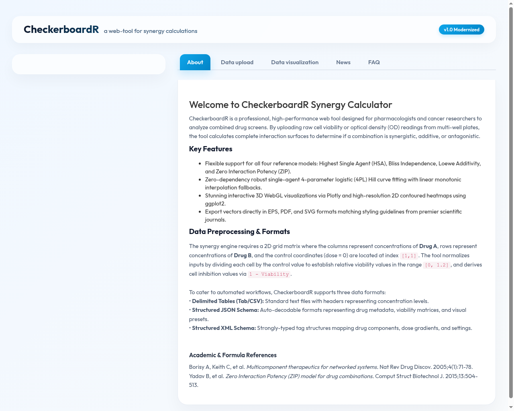
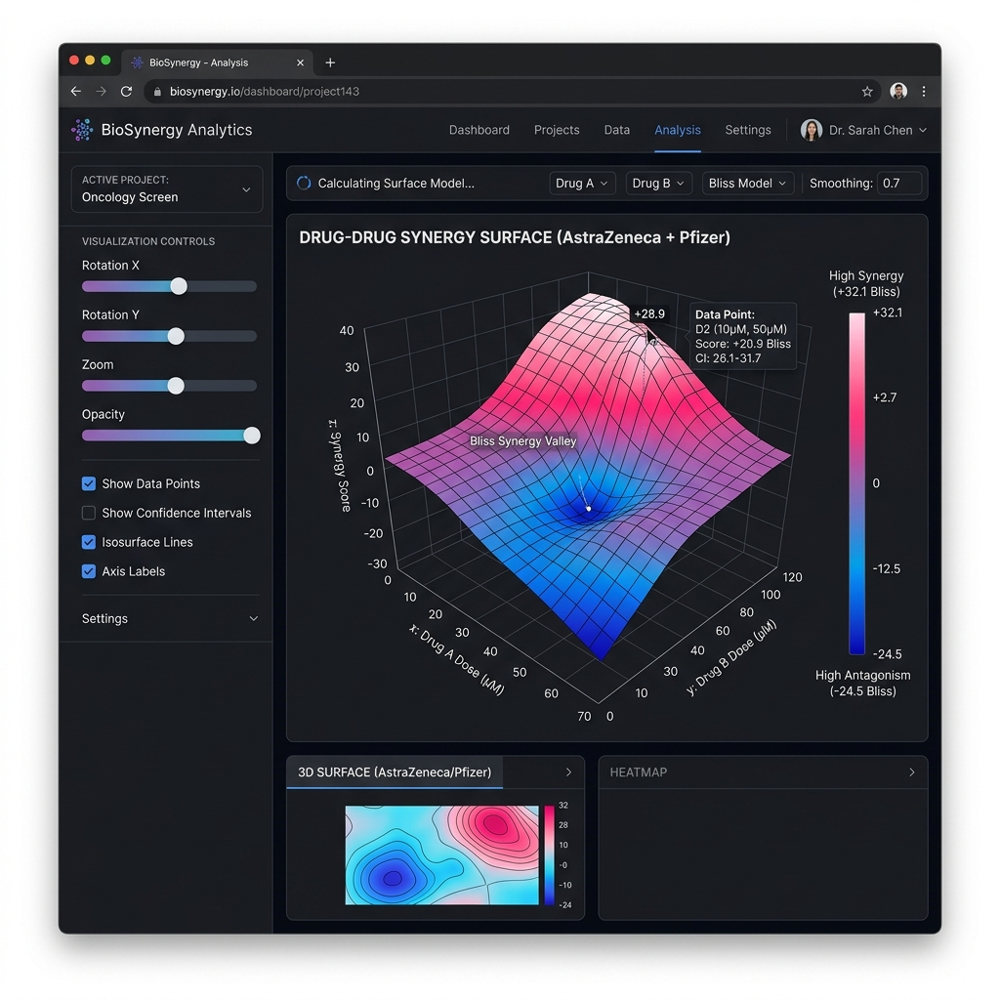

# CheckerBoardR.shiny (v2.1.0)
##### Modernized Shiny Webportal for Multi-Model Drug Combination Synergy & Antagonism Analysis

CheckerBoardR.shiny is a high-performance, premium web portal and modeling platform designed to perform drug combination synergy, antagonism, and dose-response curve fitting. It supports relative cell viability normalization, percent inhibition mapping, and robust mathematical synergy models.

Online Portal: http://chemgrid.org:3838/checkerboardr/

TyersChem2 development deployment: http://checkerboardr.198.58.117.28.nip.io/




---

## 🚀 Key Features in v2.1.0

### 1. Unified Synergy Modeling Engine
* **4-Parameter Logistic (4PL) Hill Curves:** Fits dose-response levels natively, computing $EC_{50}$, Slope (Hill coefficient), $E_{max}$, and $E_{min}$ using R's numeric optimization.
* **Synergy Models:** Computes **Highest Single Agent (HSA)**, **Bliss Independence**, **Loewe Additivity**, and **Zero Interaction Potency (ZIP)** synergy landscapes.
* **Monotonic Linear Interpolation:** Fallback routines guarantee calculation completion even under highly noisy or partial data fits.

### 2. Premium Publication-Quality Visualization Layouts
* **3D Interactive Plotly Surface:** Features dynamic 3D camera controls (Rotation/Azimuth, Elevation, Zoom/Distance) to allow researchers to view and export figures at identical angles.
* **2D ggplot Heatmap:** A beautifully formatted, contoured grid heatmap with exact text score annotations and clear legends.
* **1D Single-Agent Fit Curves:** Side-by-side dose-response curve fits for quick visual inspection.
* **Classic 3D persp Fallback (Base R):** Uses your publication-ready Blue-Green-Yellow gradient color scheme, automatically matching the chosen theme.
* **Style Guide Presets:** Integrates **Nature (Classic Grey/Arial)**, **Science (High-Contrast White/Helvetica)**, **The Economist (Sleek Blue/Trebuchet MS)**, and **Financial Times (Warm Salmon/Georgia)** style templates.

The 2D heatmap builds a vector of display values before applying the ggplot text aesthetic. This ensures that every tile is annotated with its own model score, including when the Z-axis inversion is enabled.

### 3. Axis Flips & Bliss Valley Perspective Toggles
* Interactive checkboxes let you flip the X-axis (Drug A), Y-axis (Drug B), or Z-axis (Invert score heights).
* Enables researchers to seamlessly "look into the Bliss inhibition valleys".
* **Absolute Formatting:** Negated metrics remain mathematically correct, but their tooltip hovers, tick values, and legend ranges dynamically absolute-format as positive numbers to maintain high visual clarity.

### 4. Click-to-Load Sample Data Expansion & Paste Auto-Detect
* Click-to-load samples for **JSON Chemotherapy Grids**, **XML Antifungal Grids**, **Excel spreadsheets (`.xlsx`)**, and **Delimited CSV/TAB** formats.
* Includes a pasted text area with an **intelligent auto-detector** that decodes XML or JSON payloads dynamically and updates GUI input choices automatically.

### 5. Stdio Python MCP Server
* Integrated [checkerboardr_mcp_server.py](checkerboardr_mcp_server.py), allowing LLM coding assistants to perform calculations, compute scores, and generate publication-ready plots programmatically.

### 6. Docker Containerization
* Ships with a pre-configured [Dockerfile](Dockerfile) to build and deploy the R Shiny application in any containerized environment instantly.

---

## 📦 Getting Started & Docker Deployment

To build and run the entire CheckerBoardR portal locally inside a container:

```bash
# Build the Docker image
docker build -t checkerboardr .

# Run the container (host port 3839 maps to Shiny port 3838)
docker run -p 3839:3838 checkerboardr
```

Access the app in your browser at **`http://localhost:3839`**.

---

## Native Shiny and Apache Deployment

The TyersChem2 development instance runs directly under Shiny Server behind Apache; Docker is not required for this deployment. The application source is installed at `/srv/shiny-server/checkerboardr`, with Apache exposing the public development URL shown above.

After updating application source files, restart Shiny Server and verify both the native application route and the Apache-facing URL before running the browser assessment.

---

## UX Regression Tests

Install the Playwright development dependency and its Chromium runtime:

```bash
npm install
npx playwright install chromium
```

Run the sample-only 2D heatmap assessment against a deployed instance:

```bash
CHECKERBOARDR_URL=http://checkerboardr.198.58.117.28.nip.io/ \
  npm run test:ux:sample-heatmaps
```

This test uses all six bundled sample datasets and validates:

* The uploaded matrix preview is numeric, rectangular, and concentration-labelled.
* Bliss, HSA, Loewe, ZIP, and raw Data 2D heatmaps render correctly.
* Preview-derived calculations agree with the heatmap colour ordering where they can be independently derived.
* Loewe and ZIP maintain expected zero-dose boundary behaviour and model-specific colour variation.
* X and Y flips mirror the heatmap, while the Z flip reverses its colour mapping.
* Heatmap cell labels are vectorized instead of recycling the zero-control value.

The sample assessment deliberately does not use the computed synergy summary table as its test oracle. Generated reports, screenshots, and heatmap artifacts are written below `test-results/checkerboardr-sample-heatmaps/` and are excluded from Git.

The broader visualization matrix can be run separately:

```bash
CHECKERBOARDR_URL=http://checkerboardr.198.58.117.28.nip.io/ \
  npm run test:ux:matrix
```

The heatmap-label correction was validated against 120 sample states: six datasets, five models, and baseline/X/Y/Z views. All 120 states passed on the TyersChem2 development deployment.

---

## 🛠 Contributing
1. Fork it!
2. Create your feature branch: `git checkout -b my-new-feature`
3. Commit your changes: `git commit -am 'Add some feature'`
4. Push to the branch: `git push origin my-new-feature`
5. Submit a pull request :D
